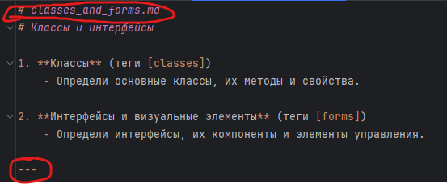
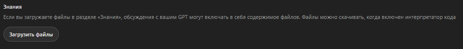
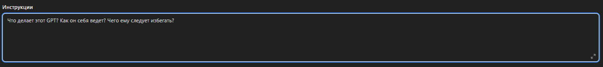

# tr-agent

Позволяет создавать промпт для Агента нейросети который будет генерить ТЗ по запросу

## Мотивация
ChatGPT поддерживает для обучения только 8000 символов, если поместить один или много файлов в его базу знаний он 
всё равно может не понять что ему следует делать. Для удобного редактирования и управления знаниями нейронки 
было решено создать простой скрипт который позволяет создать базу знаний по которой нейронке будет просто навигироваться.

Базу знаний необходимо перевести на английский чтобы нейронка лучше ориентировалась по ней, но можно попробовать 
и на русском.

## Как использовать
1) **Перейдите** в конструктор нейросети https://chatgpt.com/gpts/editor
2) **Склонируйте** проект себе на ПК
3) **Опишите** в папке `src` все шаги которые должна делать ваша нейронка уточнив все детали нужные для вашего языка.
Замену технологий и специфики можно сделать быстро на шаге 4 с помощью самого же ChatGPT.
4) **Настройте** остальные поля на свой вкус.
5) **Соедините** все файлы между собой в файл `./done/TRANSLATE_ME.md` командой
```
node 1.mjs
```
6) **Переведите** файл `./done/TRANSLATE_ME.md` на английский язык любым доступным способом или внесите другие 
комплексные изменения, например через ChatGPT, смените язык программирования и технологии, обязательно сохраните 
форматирование: выделенные красным участки меняться не должны, на них ссылается файл `general_ru.md`
После изменений скормите нейронке `general_ru.md`, пусть проверит сама себя.

7) **Разделите** переведённые файлы в изначальный вид -- после вввода команды появися папка `done`:
```
node 2.mjs
```
8) **Прикрепите** сгенерированные файлы к нейросети

9) Проверьте что сгенерированные скриптом файлы называются и отвечают за то, что описано в файле `general_ru.md`.
Тут хранятся базовые инструкции нейросети которые необходимо поместить в поле инструкции при создании.
   

**_Внимание, помните что ChatGPT может пользоваться данными которые вы ей предоставите в своих целях. 
Для полной конфиденциальности используйте self-hosted решения.**_

Изначальный промпт взят из блога https://nikitayev.livejournal.com/148713.html переработан и разделён на куски, спасибо автору.
